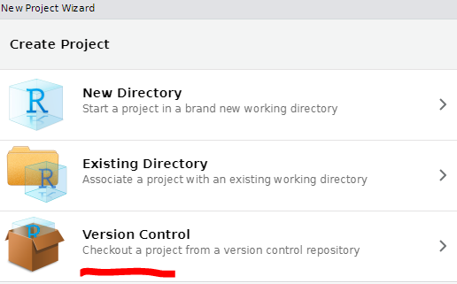
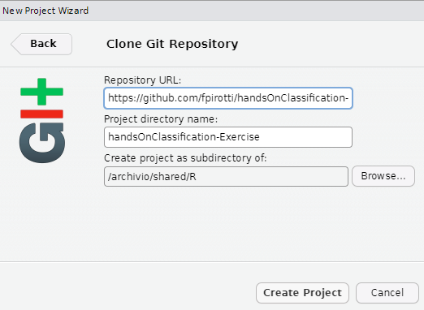

# handsOnClassification-Exercise

## Summer School "sensing mountains" 2024

### Material

For this you will need the following:

-   [R + Rstudio - follow directions at this link](https://posit.co/download/rstudio-desktop/)

-   <https://github.com/fpirotti/CloudGeometry>

In RStudio clone this project by going to "file" =\> "new project" =\> "Version control" and =\> "GIT"

Run the first two lines of "runSummerschool2024.R" to install the rest of the dependencies and run through the script.

